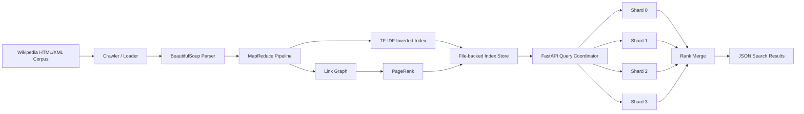
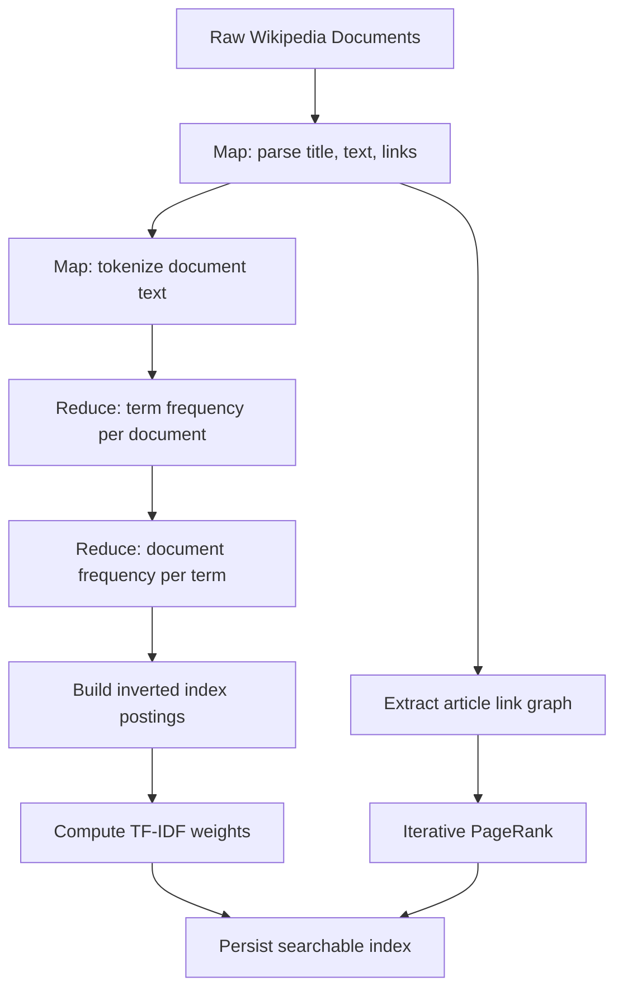
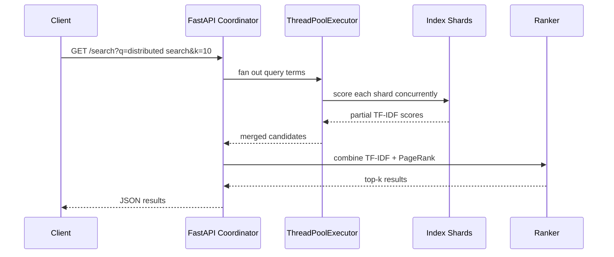

# Distributed Wikipedia Search Engine

A portfolio-grade search infrastructure project that indexes Wikipedia-style documents with a local multi-stage MapReduce pipeline, ranks results with TF-IDF plus PageRank, and serves distributed-style queries through a multi-threaded FastAPI REST API.

The default repo ships with a small sample corpus so the system runs immediately. The same ingestion command accepts a larger Wikipedia export directory and a `--limit 25000` flag to reproduce the 25,000-document indexing workflow.

## Architecture



## MapReduce Pipeline



## Query Flow



## Setup

```bash
make install
make ingest
make test
make benchmark
make serve
```

The API will be available at `http://127.0.0.1:8000`.

Useful endpoints:

- `GET /health`
- `GET /stats`
- `GET /search?q=distributed%20search&k=10`
- `GET /documents/{doc_id}`
- OpenAPI docs: `http://127.0.0.1:8000/docs`

Manual setup without Make:

```bash
python3 -m venv .venv
.venv/bin/pip install -r requirements.txt
.venv/bin/python -m search_engine.cli ingest --corpus data/sample_corpus --output data/index --shards 4
.venv/bin/uvicorn search_engine.api.app:create_app --factory --reload
```

## Docker

```bash
docker build -t distributed-wikipedia-search .
docker run --rm -p 8000:8000 distributed-wikipedia-search
```

## Building a 25,000 Document Index

Place Wikipedia HTML/XML/text documents in a local directory, then run:

```bash
.venv/bin/python -m search_engine.cli ingest \
  --corpus /path/to/wikipedia_docs \
  --output data/index \
  --limit 25000 \
  --shards 16 \
  --pagerank-iterations 20
```

This project intentionally uses a portable local file-backed index instead of requiring Hadoop, Spark, Elasticsearch, or Redis. The pipeline is MapReduce-style: each stage maps records into intermediate structures and reduces those structures into corpus-level index artifacts.

## Ranking

Search ranking uses:

- TF-IDF for text relevance: high weight for terms that are frequent in a matching document but uncommon across the corpus.
- PageRank for authority: higher weight for documents linked by other important documents.
- Final score: `0.82 * tfidf_score + 0.18 * normalized_pagerank_score`.

## Benchmark Results

Run:

```bash
make benchmark
```

The benchmark writes `results/benchmark_results.json` and compares:

- sequential shard scoring
- threaded shard scoring through `ThreadPoolExecutor`

Sample-corpus output from this implementation:

| Mode | Average latency | p50 | p95 |
| --- | ---: | ---: | ---: |
| Sequential | 0.217 ms | 0.181 ms | 0.518 ms |
| Threaded | 2.231 ms | 1.652 ms | 4.814 ms |

Latency reduction is calculated as:

```text
(sequential_avg_ms - threaded_avg_ms) / sequential_avg_ms * 100
```


The bundled six-document corpus is for setup validation. Use the 25,000-document ingestion path above for resume-scale benchmarking; record that run's output in `results/benchmark_results.json` before publishing a specific latency reduction claim.

## Project Layout

```text
search_engine/
  api/          FastAPI app and REST endpoints
  benchmark/    sequential vs threaded latency measurement
  crawler/      corpus loading
  index/        persisted index store and search engine
  mapreduce/    tokenization, TF-IDF index build, PageRank
  parser/       BeautifulSoup document parsing
data/
  sample_corpus/ bundled Wikipedia-style sample pages
tests/          unit and integration tests
results/        benchmark output
```

## Summary

Developed a scalable search infrastructure that processes Wikipedia documents using a multi-stage MapReduce pipeline, BeautifulSoup parsing, TF-IDF scoring, and PageRank authority ranking. Built a multi-threaded FastAPI query coordinator that fans out searches across local index shards and benchmarks sequential versus threaded latency.
